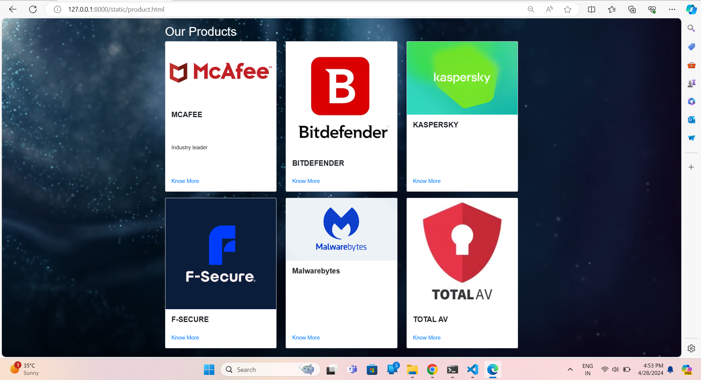
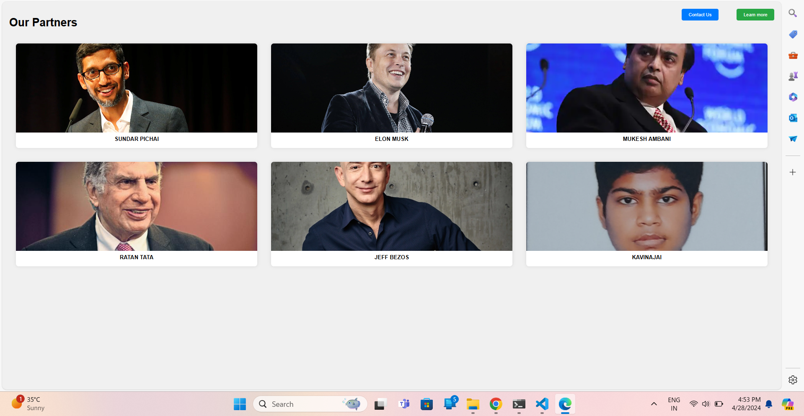
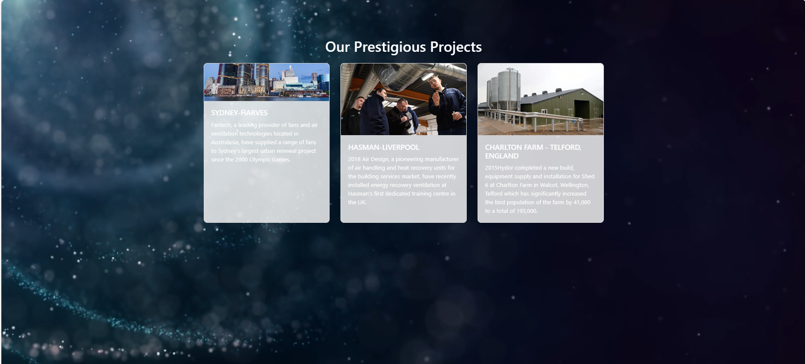

# Ex.07 Software Product Company Website
## Date: 28.04.2024

## AIM:
To develop a static company website to display the softwares and services provided by the company.

## DESIGN STEPS:

### Step 1:
Requirement collection.

### Step 2:
Creating the layout using HTML and CSS.

### Step 3:
Updating the sample content.

### Step 4:
Choose the appropriate style and color scheme.

### Step 5:
Validate the layout in various browsers.

### Step 6:
Validate the HTML code.

### Step 7:
Publish the website in the given URL.

## PROGRAM:
website.html
```
<!DOCTYPE html>
<html lang="en">
<head>
    <meta charset="UTF-8">
    <meta name="viewport" content="width=device-width, initial-scale=1.0">
    <title>SOFTWARE WEBSITE DESIGN</title>
    <style>
        * {
            margin: 0;
            padding: 0;
            box-sizing: border-box;
            font-family: Arial, Helvetica, sans-serif;
        }
        
        body {
            background-color: #f0f0f0; 
            overflow: hidden; 
            font-size: 18px;
        }

        
        #video-bg {
            position: fixed;
            right: 0;
            bottom: 0;
            min-width: 100%;
            min-height: 100%;
            width: auto;
            height: auto;
            z-index: -1;
            background-size: cover;
        }

       
        .banner {
            width: 100%;
            height: 100vh;
            display: flex;
            justify-content: center;
            align-items: center;
            flex-direction: column;
            text-align: center;
            color: white;
            position: relative; 
        }

        .navbar {
            width: 100%;
            background-color: rgba(0, 0, 0, 0.5); 
            padding: 20px 0;
            position: fixed;
            top: 0;
            z-index: 999; 
            display: flex;
            justify-content: space-between; 
            align-items: center;
            padding: 20px 50px;
        }

        .navbar ul {
            list-style: none;
            padding: 0;
            margin: 0;
            display: flex;
            justify-content: center;
            align-items: center;
        }

        .navbar li {
            margin: 0 20px;
        }

        .navbar li a {
            text-decoration: none;
            color: white;
            font-size: 20px; 
            transition: color 0.3s ease;
        }

        .navbar li a:hover {
            color: #ffd700;
        }

        .logo {
            font-size: 36px;
            font-weight: bold;
            letter-spacing: 2px;
            color: #ffd700; 
            margin-left: 20px;
        }

       
        .content {
            padding: 50px 20px;
            text-align: center;
            max-width: 800px;
            margin: auto;
            position: relative; 
        }

        .content h2 {
            font-size: 82px;
            margin-bottom: 20px;
        }

        .content p {
            font-size: 90px; 
            line-height: 1.6;
            margin-bottom: 30px;
        }

        .btn {
            padding: 16px 32px; 
            font-size: 20px; 
            background-color: #ffd700; 
            color: #222;
            border: none;
            border-radius: 5px;
            cursor: pointer;
            transition: background-color 0.3s ease;
            text-decoration: none; 
        }

        .btn:hover {
            background-color: #ffac33; 
        }

       
        .marquee {
            position: absolute;
            top: 50%;
            left: 0;
            width: 100%;
            transform: translateY(-50%);
            white-space: nowrap;
            animation: marquee 15s linear infinite; 
        }

      
        footer {
            background-color: #333;
            color: white;
            text-align: center;
            padding: 20px 0;
            width: 100%;
            position: fixed;
            bottom: 0;
        }

     
        .login-sheet {
            position: fixed;
            top: 70px; 
            right: 20px;
            background-color: rgba(255, 255, 255, 0.8);
            padding: 20px;
            border-radius: 5px;
        }

        .login-sheet input[type="text"],
        .login-sheet input[type="password"] {
            width: calc(100% - 40px); 
            padding: 10px;
            margin-bottom: 10px;
            border: 1px solid #ccc;
            border-radius: 5px;
            box-sizing: border-box;
        }

        .login-sheet input[type="submit"] {
            width: calc(100% );
            padding: 10px;
            background-color: #ffd700;
            color: #222;
            border: none;
            border-radius: 5px;
            cursor: pointer;
            transition: background-color 0.3s ease;
        }

        .login-sheet input[type="submit"]:hover {
            background-color: #ffac33;
        }
    </style>
</head>
<body>
    <video id="video-bg" autoplay muted loop>
        <source src="121799-724719792_large.mp4" type="video/mp4">
        Your browser does not support the video tag.
    </video>
    <div class="banner">
        <div class="navbar">
            <h1 class="logo">KAVIN<span>Software</span></h1>
            <ul>
                <li><a href="home.html">Home</a></li>
                <li><a href="product.html">Products</a></li>
                <li><a href="people.html">People</a></li>
                <li><a href="contact us.html">Contact</a></li>
                <li><a href="project.html">Projects</a></li>
            </ul>
        </div>
        <div class="content">
            <h2>Software Development Solutions</h2>
            <p>"Empowering Innovation, Building Futures".</p>
            <a href="get started.html" class="btn">Get Started</a>
        </div>
    </div>
    <div class="login-sheet">
        <h2>Login</h2>
        <form>
            <input type="text" placeholder="Username" required>
            <input type="password" placeholder="Password" required>
            <input type="submit" value="Login">
        </form>
    </div>
    <footer>
        <p>Designed and Developed by KAVIN Company @2024</p>
    </footer>
</body>
</html>
```
home.html
```
<!DOCTYPE html>
<html lang="en">

<head>
  <meta charset="UTF-8">
  <meta name="viewport" content="width=device-width, initial-scale=1.0">
  <title>KAVIN SOFTONICS PVT.LTD - Unleashing Innovation</title>
  <link rel="stylesheet" href="style.css">
  <style>
  
    body {
      margin: 0;
      padding: 0;
      font-family: 'Montserrat', sans-serif; 
      color: #f5f5f5; 
      background-image: url('ae6dc78efb8c332e22e3d3218565a43d (1).jpg'); 
      background-size: cover;
      background-position: center;
      height: 100vh;
      overflow: hidden;
    }

  
    header {
      display: flex;
      justify-content: space-between;
      align-items: center;
      padding: 20px 40px;
      background: rgba(0, 0, 0, 0.7); 
      position: fixed;
      width: 100%;
      z-index: 1000; 
      transition: background-color 0.3s ease; 
    }

    header:hover {
      background-color: rgba(0, 0, 0, 0.85); 
    }

    header h1 {
      font-size: 48px; 
      margin: 0;
      color: #fff; 
      text-shadow: 0 1px 2px rgba(0, 0, 0, 0.3); 
    }

    nav {
      list-style: none;
      padding: 0;
      margin: 0;
      display: flex;
      flex-direction: row;
    }

    nav li {
      margin: 0 20px;
    }

    nav li a {
      text-decoration: none;
      color: #fff; 
      font-size: 20px;
      padding: 15px 25px;
      border-radius: 5px;
      transition: background-color 0.3s ease;
    }

    nav li a:hover {
      background-color: rgba(255, 255, 255, 0.1); 
    }

  
    main {
      padding-top: 150px; 
      text-align: center;
      color: #fff; 
    }

    section {
      padding: 100px 0;
      background: rgba(0, 0, 0, 0.7); 
      border-radius: 10px;
      margin-bottom: 50px;
    }

    section h2 {
      font-size: 36px;
      margin-bottom: 30px;
      color: #ffd700; 
      text-shadow: 0 1px 2px rgba(0, 0, 0, 0.3); 
    }

    section p {
      font-size: 20px;
      line-height: 1.6;
      color: #f5f5f5;
    }

    
    form {
      display: flex;
      flex-direction: column;
      align-items: center;
      margin: 0 auto;
    }
  </style>
</head>

<body>
  <header>
    <h1>KAVIN SOFTONICS PVT. LTD.</h1>
    <nav>
      <ul>
        <li><a href="#products">Products</a></li>
        <li><a href="#about-us">About Us</a></li>
        <li><a href="#login">Login</a></li>
      </ul>
    </nav>
  </header>

  <main>
    <section id="products">
      <h2>Our Products</h2>
      <p>Explore our range of innovative software solutions.</p>
      <p>Contact us to learn more about our products.</p>
    </section>

    <section id="about-us">
      <h2>About Us</h2>
      <p>KAVIN Softonics Pvt. Ltd. is a leading software development company dedicated to providing cutting-edge solutions to businesses worldwide.</p>
      <p>With a team of experienced professionals, we strive to deliver high-quality products and exceptional customer service.</p>
    </section>

    <section id="login">
      <h2>Login</h2>
      <form action="/login" method="post">
        <label for="login-username">Username/Email:</label>
        <input type="text" id="login-username" name="username" required>
        <label for="login-password">Password:</label>
        <input type="password" id="login-password" name="password" required>
        <button type="submit">Login</button>
      </form>
    </section>
  </main>

  <footer>
    <p>&copy; KAVIN Softonics Pvt. Ltd. 2024. All Rights Reserved.</p>
  </footer>
</body>
</html>
</body>

</html>
```
product.html
```
<!DOCTYPE html>
<html lang="en">
<head>
    <meta charset="UTF-8">
    <meta name="viewport" content="width=device-width, initial-scale=1.0">
    <title>Product</title>
    
    <link rel="stylesheet" href="https://maxcdn.bootstrapcdn.com/bootstrap/4.5.2/css/bootstrap.min.css">
    <style>
        * {
            margin: 0;
            padding: 0;
            box-sizing: border-box;
        }

        body {
            font-family: Arial, sans-serif;
            overflow: hidden; /* Hide horizontal scrollbars */
        }

        #video-bg {
            position: fixed;
            right: 0;
            bottom: 0;
            min-width: 100%;
            min-height: 100%;
            width: auto;
            height: auto;
            z-index: -1;
            background-size: cover;
        }

        .container {
            max-width: 1200px;
            margin: 0 auto;
            padding: 20px;
        }

        .row {
            margin-bottom: 20px;
        }

        .card {
            margin-bottom: 20px;
            height: 100%; /* Make all cards the same height */
        }

        .card-body {
            height: 100%;
            display: flex;
            flex-direction: column;
            justify-content: space-between;
        }

        .card-title {
            font-size: 24px;
            font-weight: bold;
        }

        .card-text {
            font-size: 18px;
        }

        .know-more {
            font-size: 18px;
            color: #007bff;
            text-decoration: none;
        }

        .know-more:hover {
            color: #0056b3;
            text-decoration: underline;
        }
        .white {
            color: white;
        } 
    </style>
</head>
<body>
    <video id="video-bg" autoplay muted loop>
        <source src="121799-724719792_large.mp4" type="video/mp4">
       
    </video>

    <div class="container">
        <h1 class="white">Our Products</h1> 
        <div class="row">
            <div class="col-md-4">
                <div class="card">
                    
                    <div class="card-body">
                        <h5 class="card-title">MCAFEE</h5>
                        <p class="card-text">Industry leader</p>
                        <a href="https://www.mcafee.com/blogs/internet-security/how-to-safeguard-your-linkedin-account-and-strengthen-your-security/" class="know-more">Know More</a> 
                    </div>
                </div>
            </div>
            <div class="col-md-4">
                <div class="card">
                    
                    <div class="card-body">
                        <h5 class="card-title">BITDEFENDER</h5>
                
                        <a href="#" class="know-more">Know More</a>
                    </div>
                </div>
            </div>
            <div class="col-md-4">
                <div class="card">
                    
                    <div class="card-body">
                        <h5 class="card-title">KASPERSKY</h5>
                       
                        <a href="https://www.kaspersky.co.in/" class="know-more">Know More</a>
                    </div>
                </div>
            </div>
        </div>

        <div class="row">
            <div class="col-md-4">
                <div class="card">
                    
                    <div class="card-body">
                        <h5 class="card-title">F-SECURE</h5>
                      
                        <a href="https://www.f-secure.com/en" class="know-more">Know More</a>
                    </div>
                </div>
            </div>
            <div class="col-md-4">
                <div class="card">
                    
                    <div class="card-body">
                        <h5 class="card-title">Malwarebytes</h5>
                     
                        <a href="https://www.malwarebytes.com/" class="know-more">Know More</a>
                    </div>
                </div>
            </div>
            <div class="col-md-4">
                <div class="card">
                    
                    <div class="card-body">
                        <h5 class="card-title">TOTAL AV</h5>
                       
                        <a href="http://www.totalav.com/?forceLang=en" class="know-more">Know More</a>
                    </div>
                </div>
            </div>
        </div>
    </div>
        </div>
    </div>

   
    <script src="https://code.jquery.com/jquery-3.5.1.slim.min.js"></script>
    <script src="https://cdn.jsdelivr.net/npm/@popperjs/core@2.5.4/dist/umd/popper.min.js"></script>
    <script src="https://maxcdn.bootstrapcdn.com/bootstrap/4.5.2/js/bootstrap.min.js"></script>
</body>
</html>
```
people.html
```
<!DOCTYPE html>
<html lang="en">
<head>
    <meta charset="UTF-8">
    <meta name="viewport" content="width=device-width, initial-scale=1.0">
    <title>Partners</title>
    <style>
        body {
            font-family: Arial, sans-serif;
            margin: 0;
            padding: 20px;
            background-color: #f0f0f0;
            position: relative; 
        }

        .container {
            display: flex;
            flex-wrap: wrap;
            justify-content: center;
        }
        .partner-card {
    width: calc(33.33% - 40px);
    margin: 20px;
    text-align: center;
    background-color: #fff;
    border-radius: 8px;
    box-shadow: 0 0 10px rgba(0, 0, 0, 0.1);
    overflow: hidden;
    height: 300px; 
}


        .partner-image {
            width: 100%;
            height: 85%;
            overflow: hidden;
        }

        .partner-image img {
            width: 100%;
            height: 100%;
            object-fit: cover;
        }

        .partner-name {
            padding: 10px;
            font-weight: bold;
        }

        
        .contact-button {
            position: absolute;
            top: 20px;
            right: 180px;
            padding: 10px 20px;
            background-color: #007bff;
            color: #fff;
            border: none;
            border-radius: 5px;
            cursor: pointer;
        }

       
        .learn-more-button {
            position: absolute;
            top: 20px;
            right: 20px;
            padding: 10px 20px;
            background-color: #28a745;
            color: #fff;
            border: none;
            border-radius: 5px;
            cursor: pointer;
        }
    </style>
</head>
<body>
    <h1>Our Partners</h1>
    <div class="container">
        <div class="partner-card">
            <div class="partner-image">
                
            </div>
            <div class="partner-name">SUNDAR PICHAI</div>
        </div>
        <div class="partner-card">
            <div class="partner-image">
                
            </div>
            <div class="partner-name">ELON MUSK</div>
        </div>
        <div class="partner-card">
            <div class="partner-image">
                
            </div>
            <div class="partner-name">MUKESH AMBANI</div>
        </div>
    </div>

    <div class="container">
        <div class="partner-card">
            <div class="partner-image">
                
            </div>
            <div class="partner-name">RATAN TATA</div>
        </div>
        <div class="partner-card">
            <div class="partner-image">
                
            </div>
            <div class="partner-name">JEFF BEZOS</div>
        </div>
        <div class="partner-card">
            <div class="partner-image">
                
            </div>
            <div class="partner-name">KAVINAJAI</div>
        </div>
    </div>

    <button class="contact-button">Contact Us</button>
  
    <button class="learn-more-button">Learn more</button>
</body>
</html>
```
contact us.html
```
<!DOCTYPE html>
<html lang="en">
<head>
    <meta charset="UTF-8">
    <meta name="viewport" content="width=device-width, initial-scale=1.0">
    <title>Contact Us</title>
    <style>
        body {
            font-family: Arial, sans-serif;
            margin: 0;
            padding: 20px;
    
        }

        .container {
            max-width: 600px;
            margin: 0 auto;
            padding: 20px;
            border-radius: 8px;
            box-shadow: 0 0 10px rgba(0, 0, 0, 0.1);
            position: relative;
        }

        .bg-video {
            position: fixed;
            top: 0;
            left: 0;
            width: 100%;
            height: 100%;
            z-index: -1; 
            overflow: hidden; 
        }

        .bg-video video {
            min-width: 100%;
            min-height: 100%;
            width: auto;
            height: auto;
            position: absolute;
            top: 50%;
            left: 50%;
            transform: translate(-50%, -50%);
            z-index: -1; 
        }

        h1 {
            margin-top: 0;
        }

        p {
            margin-bottom: 20px;
        }

        label {
            display: block;
            margin-bottom: 10px;
            font-weight: bold;
        }

        input[type="text"],
        input[type="email"],
        textarea {
            width: 100%;
            padding: 10px;
            margin-bottom: 20px;
        
            border-radius: 5px;
            box-sizing: border-box;
        }

        textarea {
            resize: vertical;
            height: 150px;
        }

        input[type="submit"] {
            background-color: #007bff;
            color: #fff;
            border: none;
            padding: 10px 20px;
            border-radius: 5px;
            cursor: pointer;
        }

        input[type="submit"]:hover {
            background-color: #0056b3;
        }
    </style>
</head>
<body>

    <div class="bg-video">
        <video src="121799-724719792_large.mp4" autoplay muted loop></video>
    </div>

    <div class="container">
        <h1>Contact Us</h1>
        <p>If you have any questions or inquiries, feel free to get in touch with us. We'll get back to you as soon as possible.</p>
        
        <h2>Company Details:</h2>
        <p><strong>Company Name:</strong>KAVIN SOFTONICS</p>
        <p><strong>Address:</strong>NO:442 INDIRA NAGAR 4TH WEST STRRET INDIRA NAGAR CHENNAI 400056</p>
        <p><strong>Phone:</strong> +1 (123) 456-7890</p>
        <p><strong>Email:</strong> KSULTRASOFTONICS@yourcompany.com</p>
        
        <hr>

        <form id="contact-form">
            <label for="name">Your Name:</label>
            <input type="text" id="name" name="name" required>

            <label for="email">Your Email:</label>
            <input type="email" id="email" name="email" required>

            <label for="message">Message:</label>
            <textarea id="message" name="message" required></textarea>

            <input type="submit" value="Send">
        </form>
    </div>
</body>
</html>
```
project.html
```
<!DOCTYPE html>
<html lang="en">
<head>
  <meta charset="UTF-8">
  <meta name="viewport" content="width=device-width, initial-scale=1.0">
  <title>Prestigious Projects</title>
  <link rel="stylesheet" href="https://stackpath.bootstrapcdn.com/bootstrap/4.5.2/css/bootstrap.min.css">
  <style>

    body, html {
      height: 100%;
      margin: 0;
      padding: 0;
    }
    #video-bg {
      position: fixed;
      right: 0;
      bottom: 0;
      min-width: 100%;
      min-height: 100%;
      width: auto;
      height: auto;
      z-index: -1;
      background-size: cover;
    }

  
    .container {
      color: #fff; 
      padding-top: 80px; 
    }

  
    .card {
      width: 300px;
      height: auto;
      margin-bottom: 20px;
      border: 1px solid #ddd;
      border-radius: 10px;
      background-color: rgba(255, 255, 255, 0.8); 
    }
    .card img {
      border-top-left-radius: 10px;
      border-top-right-radius: 10px;
      max-height: 200px;
      object-fit: cover;
    }
    .card-body {
      padding: 20px;
    }
    .card-title {
      font-size: 20px;
      margin-bottom: 10px;
    }
    .card-text {
      font-size: 16px;
    }
  </style>
</head>
<body>

<video id="video-bg" autoplay muted loop>
    <source src="121799-724719792_large.mp4" type="video/mp4">
    Your browser does not support the video tag.
  </video>
  <div class="container">
    <h1 class="text-center my-4">Our Prestigious Projects</h1>
    <div class="card-deck">
    
      <div class="card">
        
        <div class="card-body">
          <h5 class="card-title">SYDNEY-HARVES</h5>
          <p class="card-text">Fantech, a leading provider of fans and air ventilation technologies located in Australasia, have supplied a range of fans to Sydney’s largest urban renewal project since the 2000 Olympic Games.</p>
        </div>
      </div>
      
      <div class="card">
        
        <div class="card-body">
          <h5 class="card-title">HASMAN-LIVERPOOL</h5>
          <p class="card-text">2018
            Air Design, a pioneering manufacturer of air handling and heat recovery units for the building services market, have recently installed energy recovery ventilation at Hasman’s first dedicated training centre in the UK.</p>
        </div>
      </div>
      
      <div class="card">
        
        <div class="card-body">
          <h5 class="card-title">CHARLTON FARM - TELFORD, ENGLAND</h5>
          <p class="card-text">2015Hydor completed a new build, equipment supply and installation for Shed 6 at Charlton Farm in Walcot, Wellington, Telford which has significantly increased the bird population of the farm by 41,000 to a total of 195,000.</p>
        </div>
      </div>
      
    </div>
  </div>

  <script src="https://code.jquery.com/jquery-3.5.1.slim.min.js"></script>
  <script src="https://cdnjs.cloudflare.com/ajax/libs/popper.js/1.16.1/umd/popper.min.js"></script>
  <script src="https://stackpath.bootstrapcdn.com/bootstrap/4.5.2/js/bootstrap.min.js"></script>
</body>

```

## OUTPUT:
.png>)




## RESULT:
The program for designing software company website using HTML and CSS is completed successfully.
